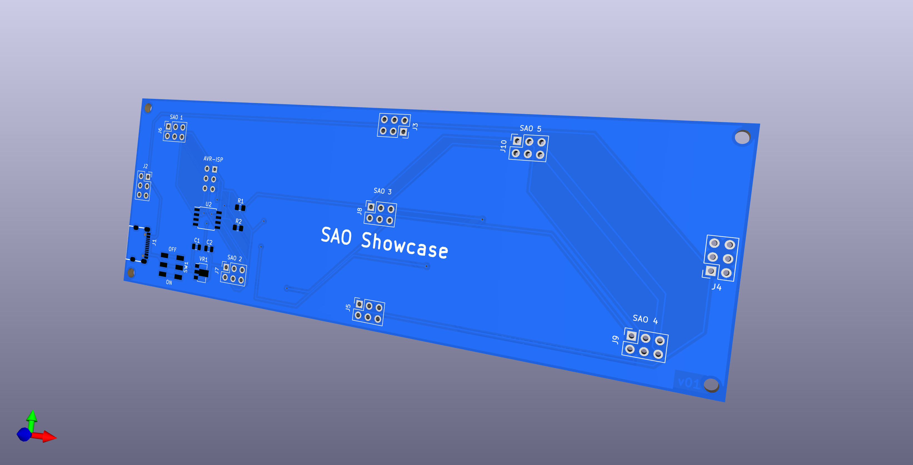

# SAP Display Platform

I had made this project after returning home from Def Con 30 with a brand 
new colelction of SAOs that jsut had to be displayed somehow.

## Fabrication

I had targeted JLCPCB.com as the manufacturer of this pcb to include their 
pick and place service. To that end the zipped gerber file along with 
the files contained within the fabrication folder were sufficient to 
facilaite that. It's quite possible that the LCSC Part number may have 
changed since then.

[]
